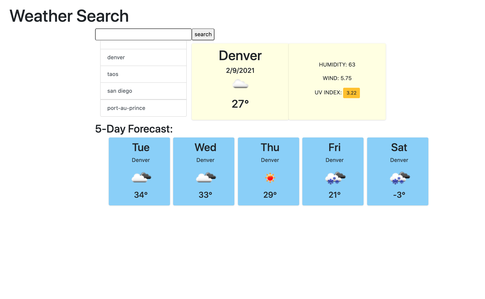

  
  
  
  # Weather Forecast
  ## Description
  #### With this app, the user is able to search for a specific city's weather. Along with the temperature, other items, such as UV index, weather descriptor icons, and humidity, will also show up. While today's weather is shown at the top, the next five days' weather is shown at the bottom. The user can type in another city to change the information shown, but their previous searches are saved in a column to the left. Easily accessible for the user to click on the name and search for that city again.
  # Table of Contents
   * [Installation](#installation)
   * [Usage](#usage)
   * [License](#license)
   * [Contributors](#contributors)
   * [Tests](#tests)
   * [Questions](#questions)
  ## Installation
  #### Internet access.
  ## Usage
  #### Screenshot of page when city is searched:
  
  ## License
  #### This project is licensed under the MIT license.
  ## Contributing
  #### Katie Anilionis
  ## Test
  #### 
  ## Questions
  #### Email: <a>kanilionis@gmail.com</a>
  #### GitHub: <a>github.com/kanilionis</a>
  